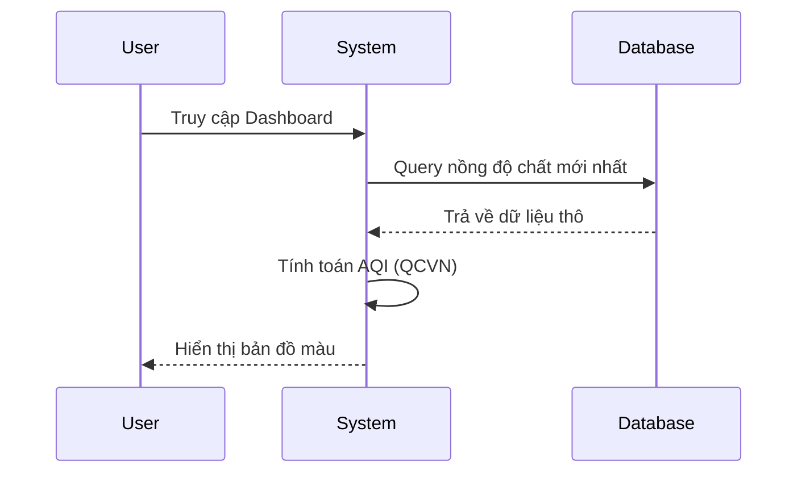
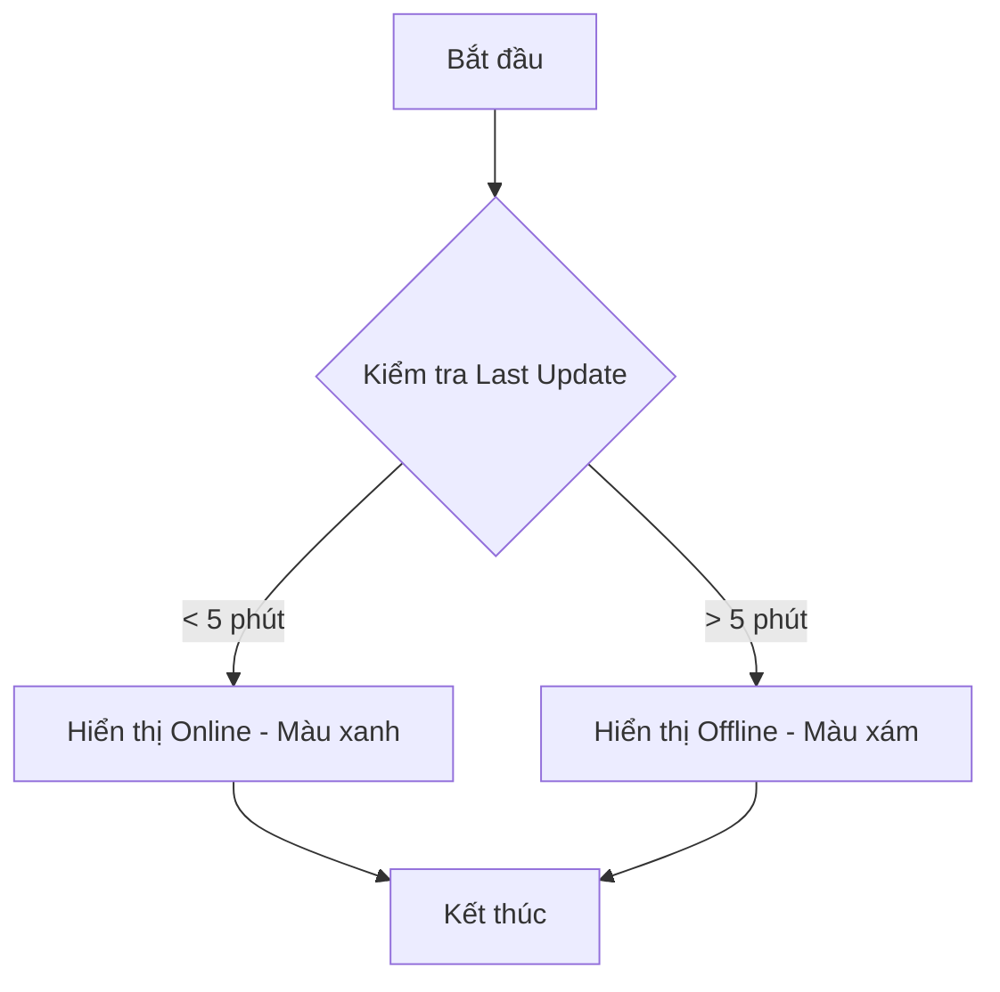
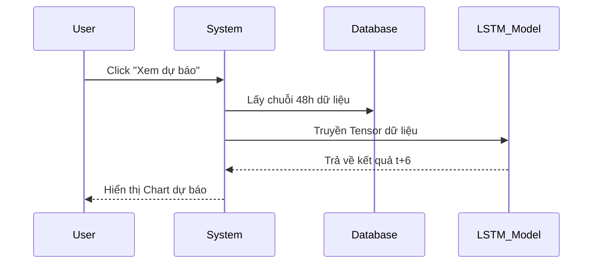
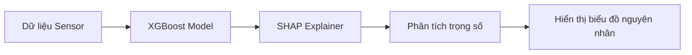
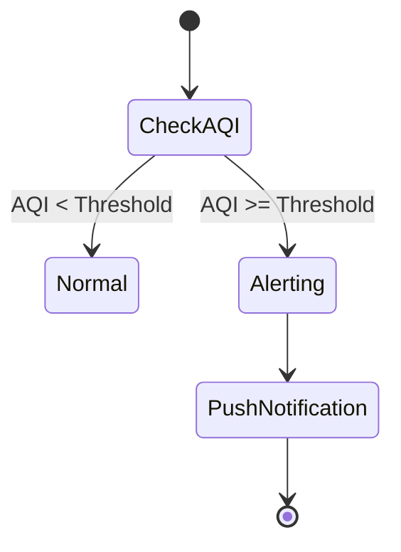
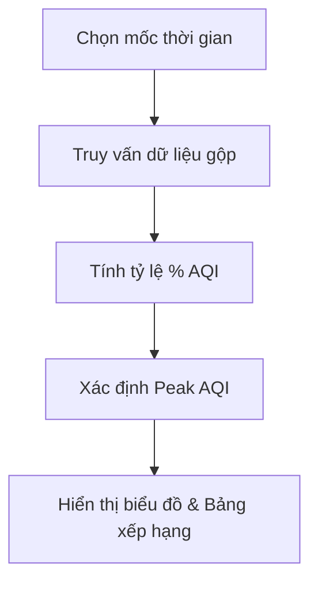
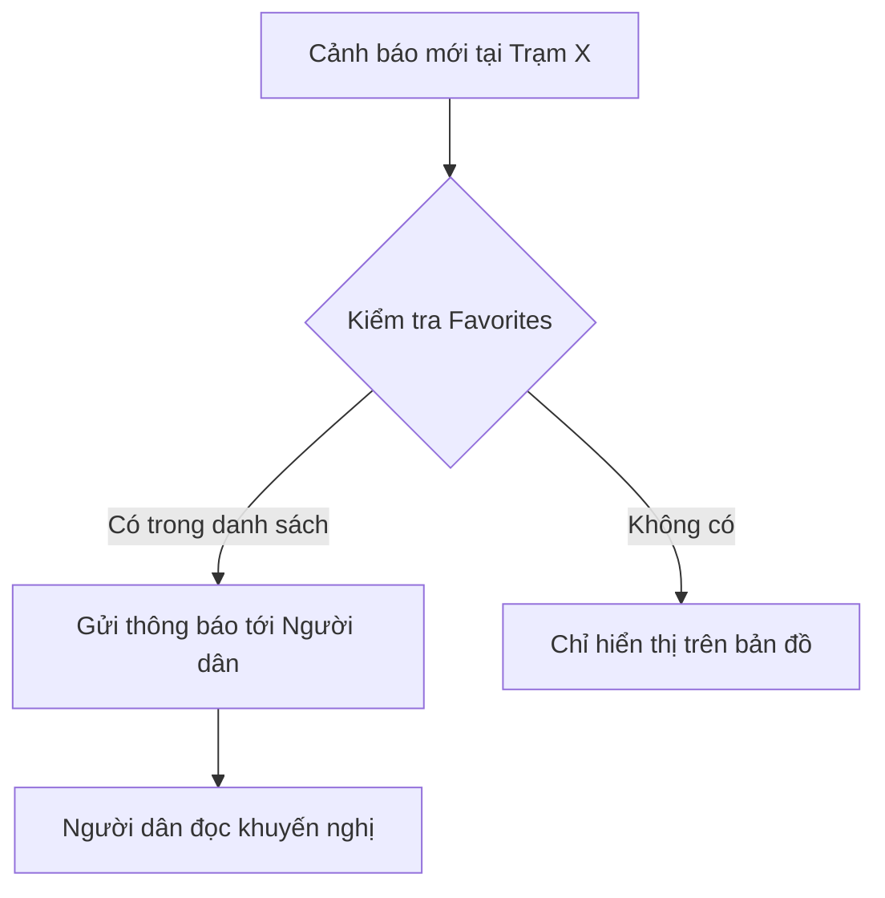
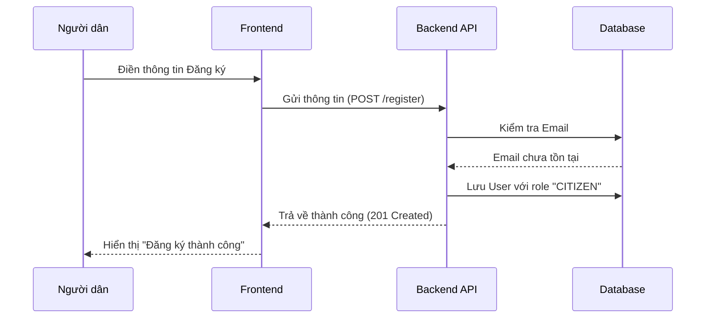

# ĐẶC TẢ CHI TIẾT CHỨC NĂNG HỆ THỐNG AIRGUARD BN

Tài liệu này mô tả chi tiết quy trình vận hành của 10 chức năng cốt lõi trong hệ thống, bao gồm các luồng sự kiện và mô hình hóa quy trình.

---

## 1. Bản đồ AQI thời gian thực (GIS Dashboard)
**Mô tả:** Hiển thị trực quan chỉ số AQI trên bản đồ tỉnh Bắc Ninh.
*   **Luồng sự kiện chính:**
    1. Người dùng truy cập Dashboard.
    2. Hệ thống gọi API lấy dữ liệu cảm biến mới nhất từ Database.
    3. Hệ thống tính toán AQI theo QCVN.
    4. Hệ thống render màu sắc các trạm lên bản đồ.
*   **Luồng sự kiện thay thế:**
    *   *Lỗi kết nối DB:* Hệ thống hiển thị thông báo "Không thể tải dữ liệu" và hiển thị bản đồ trống.

---

## 2. Theo dõi trạng thái trạm (Station Monitoring)
**Mô tả:** Giám sát tình trạng hoạt động kỹ thuật của mạng lưới cảm biến.
*   **Luồng sự kiện chính:**
    1. Quản lý vào mục "Trạng thái trạm".
    2. Hệ thống kiểm tra thời gian cập nhật cuối cùng của từng trạm.
    3. Hệ thống so sánh với thời gian thực tế.
    4. Nếu chênh lệch < 5 phút, hiển thị "Online", ngược lại "Offline".
*   **Luồng sự kiện thay thế:**
    *   *Mất tín hiệu kéo dài:* Hệ thống đánh dấu trạm cần bảo trì bằng biểu tượng đỏ.

---

## 3. Dự báo AQI 6 giờ (LSTM Forecast)
**Mô tả:** Sử dụng AI để dự đoán xu hướng không khí trong tương lai.
*   **Luồng sự kiện chính:**
    1. Người dùng chọn chức năng "Dự báo".
    2. Hệ thống lấy 48 giờ dữ liệu quá khứ.
    3. Model LSTM thực hiện inference.
    4. Hệ thống hiển thị biểu đồ đường dự báo cho 6 giờ tiếp theo.
*   **Luồng sự kiện thay thế:**
    *   *Thiếu dữ liệu (Input < 48h):* Hệ thống thông báo "Dữ liệu không đủ để dự báo".

---

## 4. Giải thích nguyên nhân (SHAP Interpretation)
**Mô tả:** Giải thích yếu tố nào đang ảnh hưởng đến AQI hiện tại.
*   **Luồng sự kiện chính:**
    1. Người dùng chọn trạm và nhấn "Phân tích nguyên nhân".
    2. Hệ thống gọi mô hình XGBoost và SHAP.
    3. Hệ thống tính toán trọng số của các biến đầu vào (bụi, khí, gió, nhiệt).
    4. Hiển thị biểu đồ thanh Feature Importance.
*   **Luồng sự kiện thay thế:**
    *   *Dữ liệu khí tượng trống:* Hệ thống chỉ phân tích dựa trên nồng độ chất.

---

## 5. Cấu hình ngưỡng an toàn QCVN
**Mô tả:** Thiết lập các mốc AQI để kích hoạt hệ thống.
*   **Luồng sự kiện chính:**
    1. Quản lý vào trang "Cấu hình".
    2. Nhập các giá trị ngưỡng (ví dụ: 100-Kém, 200-Xấu).
    3. Lưu cấu hình vào Database.
    4. Hệ thống cập nhật logic kiểm tra ngay lập tức.
*   **Luồng sự kiện thay thế:**
    *   *Giá trị không hợp lệ:* Hệ thống yêu cầu nhập lại số dương và theo thứ tự tăng dần.

---

## 6. Tự động phát thông báo cảnh báo
**Mô tả:** Tự động đẩy thông báo khi phát hiện ô nhiễm.
*   **Luồng sự kiện chính:**
    1. Worker chạy định kỳ kiểm tra AQI mới.
    2. So sánh AQI với ngưỡng đã cấu hình.
    3. Nếu AQI vượt ngưỡng, tạo Notification.
    4. Gửi Firebase/Push notification tới người dùng.
*   **Luồng sự kiện thay thế:**
    *   *Mất kết nối mạng:* Cảnh báo được lưu vào hàng đợi và gửi lại khi có mạng.

---

## 7. Phê duyệt & Đẩy khuyến nghị sức khỏe
**Mô tả:** Nhà quản lý gửi lời khuyên đến người dân.
*   **Luồng sự kiện chính:**
    1. Quản lý soạn thảo nội dung khuyến nghị.
    2. Chọn khu vực áp dụng (Ví dụ: Làng nghề Phong Khê).
    3. Nhấn "Gửi khuyến nghị".
    4. Người dân tại khu vực đó nhận được thông báo.

---

## 8. Thống kê AQI (Statistics Analytics)
**Mô tả:** Tổng hợp dữ liệu dưới dạng biểu đồ phân tích cho nhà quản lý.
*   **Luồng sự kiện chính:**
    1. Quản lý chọn thời gian (Tháng/Năm) và phạm vi (Toàn tỉnh hoặc Làng nghề).
    2. Hệ thống tính toán tỷ lệ các mức AQI (ví dụ: 60% ngày Tốt, 20% ngày Xấu).
    3. Hệ thống tìm ra giá trị AQI cao nhất và thấp nhất trong kỳ.
    4. Hiển thị biểu đồ tròn (Pie Chart) về phân bố AQI và bảng xếp hạng ô nhiễm.
*   **Luồng sự kiện thay thế:**
    *   *Dữ liệu trống:* Thông báo "Chưa đủ dữ liệu để thống kê trong khoảng thời gian này".

---

## 10. Tiếp nhận cảnh báo & Khuyến nghị (Giao diện Người dân)
**Mô tả:** Người dân thụ hưởng thông tin cá nhân hóa từ hệ thống dựa trên danh sách theo dõi.
*   **Luồng sự kiện chính:**
    1. Người dân mở ứng dụng (đã đăng nhập).
    2. Hệ thống kiểm tra danh sách `user_favorites`.
    3. Nếu có cảnh báo mới tại các trạm yêu thích, hệ thống hiển thị popup/notification.
    4. Người dân đọc nội dung khuyến nghị cụ thể từ nhà quản lý cho khu vực đó.
*   **Luồng sự kiện thay thế:**
    *   *Chưa chọn trạm yêu thích:* Hệ thống chỉ hiển thị các thông tin cảnh báo chung trên bản đồ.

---

## 11. Đăng ký & Trạm quan tâm (Dành cho Người dân)
**Mô tả:** Người dân tạo tài khoản và chọn các điểm quan tâm để nhận tin.
*   **Luồng sự kiện chính:**
    1. Người dân đăng ký/đăng nhập tài khoản.
    2. Duyệt danh sách trạm hoặc bản đồ.
    3. Nhấn nút "Quan tâm/Theo dõi" tại các trạm mong muốn.
    4. Hệ thống lưu vào bảng `user_favorites`.
    5. Từ lúc này, mọi thông báo liên quan đến trạm đó sẽ được ưu tiên gửi tới người dân.

---
**Hết tài liệu đặc tả.**
